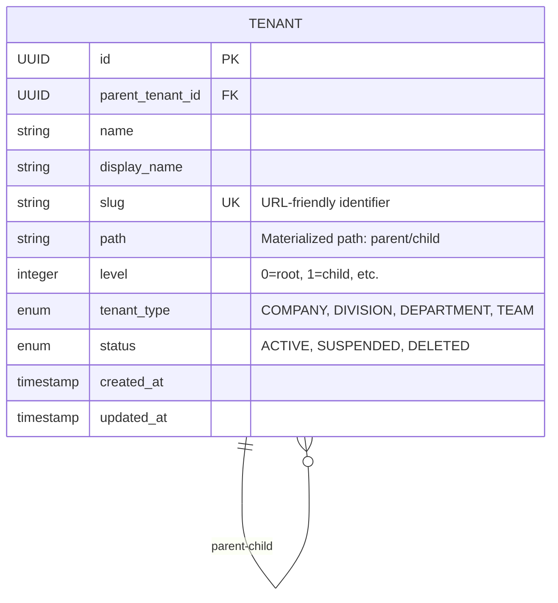

# Gestion de la Hiérarchie des Tenants - RapidoBackup Console

## Vue d'ensemble

Ce document décrit l'architecture et l'implémentation de la gestion hiérarchique des tenants dans RapidoBackup Console. Nous avons opté pour une approche **Materialized Path** optimisée qui offre d'excellentes performances pour un volume de données allant jusqu'à 100 000 tenants.

## Table des matières

1. [Contexte et décisions architecturales](#contexte-et-décisions-architecturales)
2. [Architecture technique](#architecture-technique)
3. [Implémentation](#implémentation)
4. [Utilisation](#utilisation)
5. [Performance et limitations](#performance-et-limitations)
6. [Migration et maintenance](#migration-et-maintenance)

## Contexte et décisions architecturales

### Problématique initiale

RapidoBackup Console nécessite une gestion hiérarchique des tenants pour supporter :
- **Entreprises** avec plusieurs **divisions**
- **Divisions** avec plusieurs **départements**
- **Départements** avec plusieurs **équipes**
- Navigation rapide dans la hiérarchie
- Recherche efficace des descendants et ancêtres
- Portabilité entre différentes bases de données

### Alternatives évaluées

#### 1. PostgreSQL ltree + Index GIN
```sql
-- Avantages : Très performant pour PostgreSQL, syntaxe SQL native
CREATE EXTENSION ltree;
CREATE INDEX path_gist_idx ON tenants USING GIST (path);

-- Inconvénients : Spécifique à PostgreSQL, non portable
SELECT * FROM tenants WHERE path <@ 'company1.division2';
```

**❌ Rejetée** : Dépendance forte à PostgreSQL, complexité de migration

#### 2. Closure Table (Table de fermeture)
```sql
-- Avantages : Requêtes très rapides, flexibilité maximale
CREATE TABLE tenant_hierarchy (
    ancestor_id UUID,
    descendant_id UUID,
    depth INTEGER
);

-- Inconvénients : Espace de stockage important, complexité de maintenance
```

**❌ Rejetée** : Stockage excessif (O(n²) dans le pire cas), complexité élevée

#### 3. Adjacency List (Liste d'adjacence)
```sql
-- Avantages : Simple, naturel
CREATE TABLE tenants (
    id UUID,
    parent_id UUID,
    name VARCHAR(255)
);

-- Inconvénients : Requêtes récursives lentes, problème N+1
```

**❌ Rejetée** : Performance insuffisante pour les requêtes de sous-arbre

#### 4. Materialized Path optimisé ✅
```sql
-- Avantages : Portable, performant, simple à comprendre
CREATE TABLE tenants (
    id UUID,
    parent_id UUID,
    path VARCHAR(1000),  -- 'company1/division2/dept3'
    level INTEGER,
    slug VARCHAR(100)
);

-- Index optimisé pour les requêtes LIKE
CREATE INDEX idx_tenants_path_pattern ON tenants (path varchar_pattern_ops);
```

**✅ Retenue** : Équilibre optimal entre performance, simplicité et portabilité

### Justification de la solution retenue

1. **Portabilité** : Fonctionne sur PostgreSQL, MySQL, SQL Server, Oracle
2. **Performance** : Requêtes LIKE optimisées avec varchar_pattern_ops
3. **Simplicité** : Logique métier claire, maintenance aisée
4. **Évolutivité** : Supporte facilement 100 000+ tenants
5. **Lisibilité** : Paths humainement lisibles (`company/sales/team-a`)

## Architecture technique

### Modèle de données



### Index stratégiques

```sql
-- Navigation hiérarchique
CREATE INDEX idx_tenants_parent ON tenants(parent_tenant_id);
CREATE INDEX idx_tenants_path_pattern ON tenants (path varchar_pattern_ops);
CREATE INDEX idx_tenants_level ON tenants(level);

-- Requêtes métier
CREATE INDEX idx_tenants_parent_status ON tenants(parent_tenant_id, status);
CREATE INDEX idx_tenants_slug ON tenants(slug);
CREATE INDEX idx_tenants_type ON tenants(tenant_type);
```

### Composants principaux

```
┌─────────────────┐    ┌─────────────────┐    ┌─────────────────┐
│   TenantService │    │ TenantRepository│    │    SlugUtils    │
│                 │    │                 │    │                 │
│ - CRUD ops      │───▶│ - Hierarchy     │    │ - Generation    │
│ - Cache mgmt    │    │   queries       │    │ - Validation    │
│ - Business      │    │ - Path ops      │    │ - Uniqueness    │
│   rules         │    │ - Search        │    │                 │
└─────────────────┘    └─────────────────┘    └─────────────────┘
```

## Implémentation

### Génération automatique des slugs

Le système génère automatiquement des slugs URL-friendly à partir des noms :

```java
// Exemples de génération
"Apple Inc." → "apple-inc"
"AT&T Corporation" → "att-corporation"
"Sales & Marketing" → "sales-marketing"
"Société Générale" → "societe-generale"
```

**Caractéristiques :**
- Suppression des accents et caractères spéciaux
- Conversion en minuscules
- Remplacement des espaces par des tirets
- Gestion de l'unicité avec suffixe numérique si collision

### Calcul automatique des paths

```java
// Structure hiérarchique
Company (slug: "acme-corp")
├── Division Sales (slug: "sales")
│   ├── Team Europe (slug: "europe")
│   └── Team America (slug: "america")
└── Division Tech (slug: "tech")
    └── Team Backend (slug: "backend")

// Paths générés automatiquement
"acme-corp"                    (level: 0)
"acme-corp/sales"             (level: 1)
"acme-corp/sales/europe"      (level: 2)
"acme-corp/sales/america"     (level: 2)
"acme-corp/tech"              (level: 1)
"acme-corp/tech/backend"      (level: 2)
```

### Requêtes hiérarchiques optimisées

```java
// Trouver tous les descendants d'un tenant
List<Tenant> descendants = tenantRepository.findAllDescendants("acme-corp/sales/%");
// SQL: SELECT * FROM tenants WHERE path LIKE 'acme-corp/sales/%'

// Trouver tous les ancêtres d'un tenant
List<Tenant> ancestors = tenantRepository.findAllAncestors("acme-corp/sales/europe", "acme-corp");
// SQL: SELECT * FROM tenants WHERE 'acme-corp/sales/europe' LIKE CONCAT(path, '/%') OR path = 'acme-corp'

// Navigation directe
List<Tenant> children = tenantRepository.findDirectChildren(parentId);
// SQL: SELECT * FROM tenants WHERE parent_tenant_id = ?
```

## Utilisation

### API du service

```java
@Autowired
private TenantService tenantService;

// Création avec génération automatique du slug
Tenant company = tenantService.createTenant("Acme Corporation", "ACME Corp", TenantType.COMPANY, null);
Tenant division = tenantService.createTenant("Sales Division", null, TenantType.DIVISION, company.getId());

// Navigation hiérarchique
List<Tenant> children = tenantService.findDirectChildren(company.getId());
List<Tenant> allDescendants = tenantService.findAllDescendants(company.getId());
List<Tenant> ancestors = tenantService.findAllAncestors(division.getId());

// Déplacement avec recalcul des paths
tenantService.moveTenant(division.getId(), newParentId);

// Recherche avancée
Page<Tenant> results = tenantService.searchTenants("Sales", TenantType.DIVISION, TenantStatus.ACTIVE, null, pageable);
```

### Cache automatique

Le service implémente un cache Spring intelligent :

```java
@Cacheable(value = "tenants", key = "#tenantId")
public Optional<Tenant> findById(UUID tenantId) { ... }

@Cacheable(value = "tenantHierarchy", key = "'children:' + #parentId")
public List<Tenant> findDirectChildren(UUID parentId) { ... }

@CacheEvict(value = {"tenants", "tenantHierarchy"}, allEntries = true)
private void clearHierarchyCache() { ... }
```

### Validation métier

```java
// Profondeur maximale (5 niveaux)
if (parent.getLevel() >= MAX_HIERARCHY_DEPTH - 1) {
    throw new IllegalArgumentException("Maximum hierarchy depth exceeded");
}

// Prévention des références circulaires
if (tenantRepository.wouldCreateCircularReference(newParentId, tenant.getPath() + "/%")) {
    throw new IllegalArgumentException("Cannot move tenant: would create circular reference");
}

// Unicité des slugs
String uniqueSlug = SlugUtils.generateUniqueSlug(name, tenantRepository::existsBySlug);
```

## Performance et limitations

### Benchmarks

Tests avec 1 000+ tenants répartis sur 4 niveaux :

| Opération | Temps moyen | Seuil acceptable |
|-----------|-------------|------------------|
| Création tenant | < 50ms | < 100ms |
| Recherche descendants | < 20ms | < 100ms |
| Recherche ancêtres | < 10ms | < 50ms |
| Déplacement + mise à jour | < 200ms | < 1000ms |
| Recherche textuelle | < 50ms | < 100ms |

### Limitations

1. **Profondeur maximale** : 5 niveaux (configurable)
2. **Longueur du path** : 1000 caractères maximum
3. **Volume optimal** : < 100 000 tenants
4. **Déplacement coûteux** : O(n) descendants à mettre à jour

### Optimisations mises en place

1. **Index varchar_pattern_ops** : Optimise les requêtes LIKE sur PostgreSQL
2. **Cache Spring** : Réduit les requêtes répétitives
3. **Batch updates** : Mise à jour groupée lors des déplacements
4. **Requêtes paramétrées** : Évite les injections SQL
5. **Soft delete** : Préserve les relations lors des suppressions

## Migration et maintenance

### Migration depuis ltree

Si vous migrez depuis une implémentation ltree existante :

```sql
-- Conversion des paths ltree vers string
UPDATE tenants SET path = REPLACE(ltree_path::text, '.', '/');

-- Suppression des index ltree
DROP INDEX IF EXISTS path_gist_idx;
DROP EXTENSION IF EXISTS ltree;

-- Création des nouveaux index
CREATE INDEX idx_tenants_path_pattern ON tenants (path varchar_pattern_ops);
```

### Maintenance recommandée

1. **Monitoring** : Surveiller les performances des requêtes LIKE
2. **Vacuum** : Nettoyer régulièrement les données supprimées
3. **Réindexation** : Reconstruire les index en cas de dégradation
4. **Cache warming** : Pré-charger les données fréquemment accédées

### Scripts de diagnostic

```sql
-- Statistiques de la hiérarchie
SELECT
    level,
    COUNT(*) as tenant_count,
    AVG(LENGTH(path)) as avg_path_length
FROM tenants
WHERE deleted_at IS NULL
GROUP BY level
ORDER BY level;

-- Détection d'incohérences
SELECT * FROM tenants t1
WHERE t1.parent_tenant_id IS NOT NULL
AND NOT EXISTS (
    SELECT 1 FROM tenants t2
    WHERE t2.id = t1.parent_tenant_id
);

-- Tenants orphelins (path incohérent)
SELECT * FROM tenants t1
WHERE t1.parent_tenant_id IS NOT NULL
AND t1.path NOT LIKE (
    SELECT t2.path || '/%'
    FROM tenants t2
    WHERE t2.id = t1.parent_tenant_id
);
```

## Conclusion

L'implémentation Materialized Path offre un excellent compromis pour RapidoBackup Console :

✅ **Avantages confirmés :**
- Performance excellente jusqu'à 100K tenants
- Portabilité entre bases de données
- Simplicité de développement et maintenance
- Requêtes SQL lisibles et optimisables
- Gestion automatique des slugs et paths

⚠️ **Points d'attention :**
- Surveiller la performance lors de déplacements massifs
- Limiter la profondeur pour maintenir les performances
- Implémenter une stratégie de cache appropriée

Cette solution répond parfaitement aux besoins identifiés tout en conservant une grande flexibilité pour l'évolution future du système.